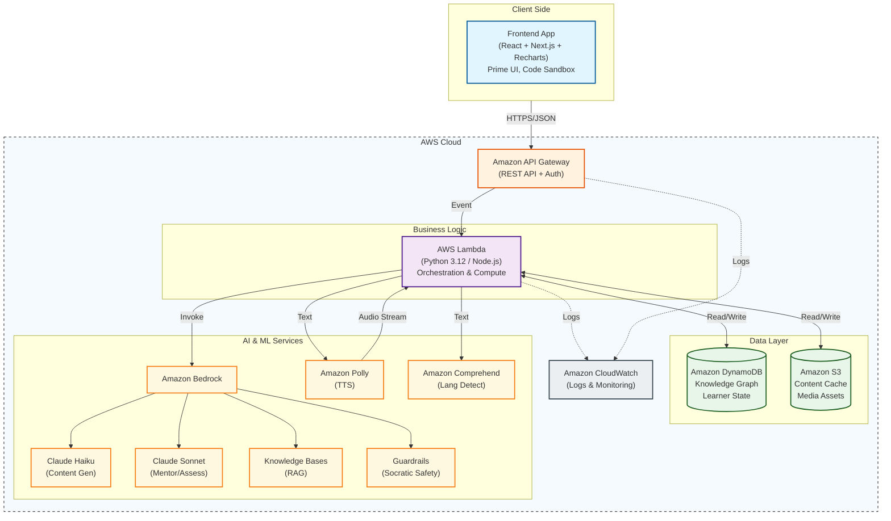

# PrimeLearn System Architecture

This document outlines the high-level architecture of the PrimeLearn platform, connecting the Frontend, Backend, and AWS AI services.

## Service Role Descriptions

| Service | Role | Free Tier Coverage |
| :--- | :--- | :--- |
| **Amazon Bedrock** | **Core AI Engine**. Orchestrates calls to Claude models. | No (Pay-per-token) |
| **Claude Haiku** | **Content Generation**. Fast, cheap model for generating episodes (90% of calls). | N/A |
| **Claude Sonnet** | **Higher Intelligence**. Powering the Socratic Mentor and Final Assessments. | N/A |
| **AWS Lambda** | **Serverless Compute**. Runs BKT algorithms, struggle detection, and API logic. | 1M req/mo (Always Free) |
| **Amazon DynamoDB** | **NoSQL Database**. Stores the Knowledge Graph (DAG), User Progress, and Logs. | 25GB (Always Free) |
| **Amazon S3** | **Object Storage**. Caches generated content and stores static assets/media. | 5GB (12 months) |
| **API Gateway** | **API Front Door**. Manages REST endpoints, auth, and throttling. | 1M calls/mo (12 months) |
| **Amazon Polly** | **Text-to-Speech**. Converts narrative episodes to audio for accessibility. | 5M chars/mo (12 months) |
| **Amazon Comprehend**| **NLP**. Detects language (Hindi/English) to trigger Hinglish mode. | 50K units/mo (12 months) |
